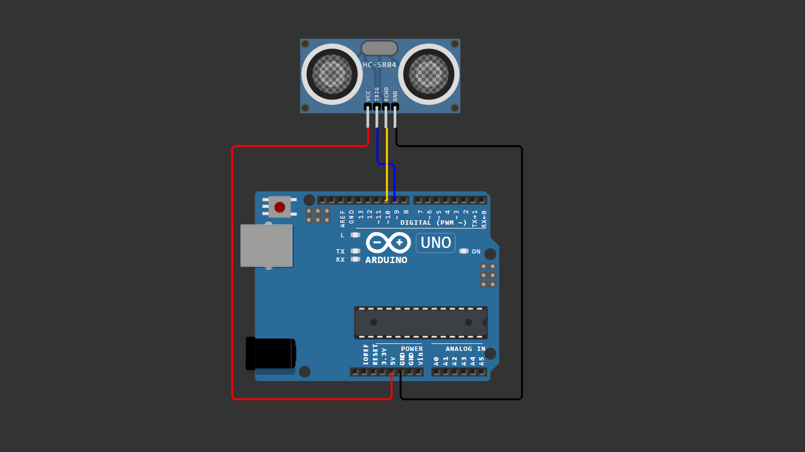

# Arduino Ultrasonic Distance Test

A beginner-friendly Arduino project demonstrating how to measure distance using an ultrasonic sensor.

This project uses the HC-SR04 ultrasonic sensor to detect the distance between the sensor and an object and displays the measured value on the Serial Monitor.

---

## 📌 Project Overview

The HC-SR04 ultrasonic sensor measures distance by sending a high-frequency sound wave and waiting for the echo to return.

Arduino calculates the distance based on the time it takes for the sound wave to travel to the object and back.

This project helps beginners understand how ultrasonic sensors work and how Arduino processes timing signals to calculate distance.

---

## 🧰 Components Required

- Arduino Uno / Nano  
- HC-SR04 Ultrasonic Sensor  
- Jumper Wires  
- Breadboard (optional)

---

## 🔌 Wiring Connections

| HC-SR04 | Arduino |
|--------|---------|
| VCC    | 5V      |
| GND    | GND     |
| TRIG   | Pin 9   |
| ECHO   | Pin 10  |

---

## 📷 Wiring Diagram

> Make sure your wiring matches the diagram above before uploading the code.

---

## 💻 Arduino Code

You can download the Arduino sketch here:

[Download Arduino Code](Arduino_Ultrasonic_Distance_Test.ino)

Or open the `.ino` file directly inside this repository.

---

## 🚀 Getting Started

1. Connect all components according to the wiring table.
2. Upload the provided Arduino sketch.
3. Open **Serial Monitor**.
4. Set baud rate to **9600**.
5. Place an object in front of the sensor to see the measured distance.

---

## 🧠 Learning Concepts

This project helps you understand:

- Ultrasonic distance measurement
- Sensor trigger and echo signals
- Using `pulseIn()` to measure time
- Distance calculation from sound travel time
- Serial communication basics

---

## 🔄 Possible Improvements

You can expand this project by adding:

- LCD display for distance
- Distance-based LED indicator
- Distance alarm using buzzer
- Automatic door sensor
- Object detection system for robots

---

## 🎥 Video Tutorial

Watch the full step-by-step tutorial on YouTube:

👉 https://youtu.be/YOUR_VIDEO_LINK

In this video, you will see:
- Complete wiring demonstration  
- Code explanation  
- Live distance testing  
- Real-time distance reading on Serial Monitor  

If this project helps you, consider subscribing for more beginner-friendly Arduino tutorials 🚀

---

## 📄 License

This project is open-source and free to use for educational purposes.

---

Happy Coding 🚀
